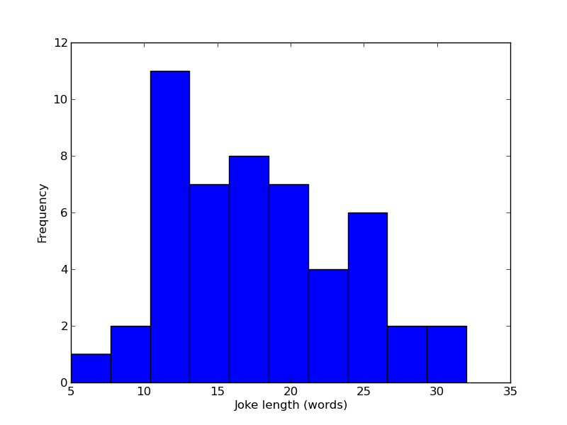
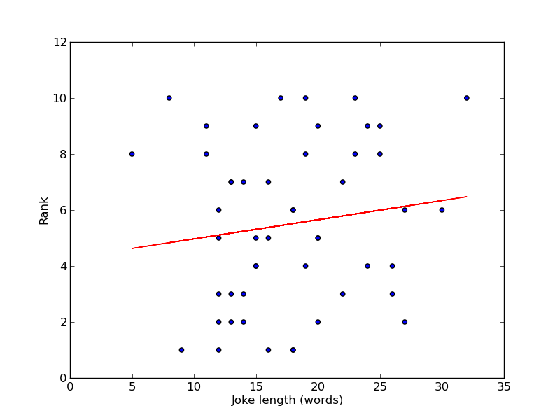
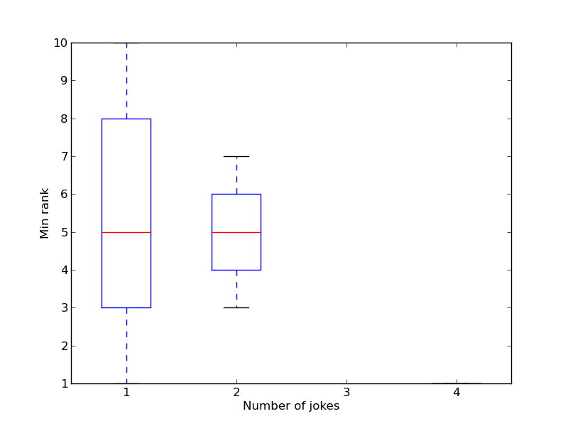
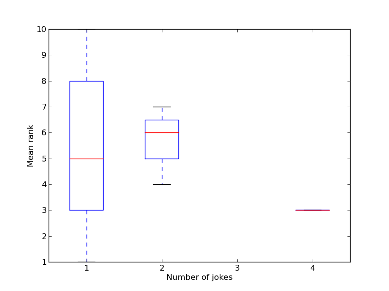
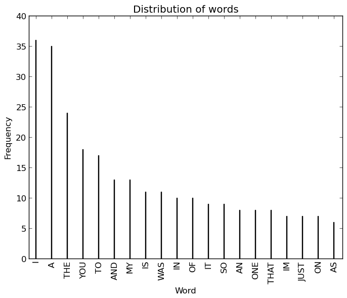

The [Edinburgh Fringe Festival](https://www.edfringe.com/) takes place every year and according to [Wikipedia](http://en.wikipedia.org/wiki/Edinburgh_Festival_Fringe) "is the world's largest arts festival, with the 2012 event spanning 25 days totalling over 2,695 shows from 47 countries in 279 venues". Every year at the festival there is a competition for the funniest one line joke. The winner for 2013 was this joke by Rob Auton:

> "I hear a rumour that Cadbury is bringing out an oriental chocolate bar. Could be a Chinese Wispa"

You can see all the top 10s over the past year here:

- [2013](http://www.bbc.co.uk/news/uk-scotland-23753634)
- [2012](http://www.bbc.co.uk/news/uk-scotland-19316443)
- [2011](http://www.bbc.co.uk/news/uk-scotland-14646532)
- [2010](http://www.bbc.co.uk/news/uk-scotland-11053202)
- [2009](http://news.bbc.co.uk/1/hi/scotland/edinburgh_and_east/8216991.stm)

I've spent an hour or so this evening grabbing all the jokes and doing some very basic analysis of them in Python. The full github repo with all the code (and the data set) can be found [here](https://github.com/drvinceknight/EdinburghFringeJokes).

# Shorter jokes are better

The mean length of the jokes are 88 characters and 17 words. Taking a look at the distribution of the word counts we see that quite a large proportion of the jokes have between 10 and 15 words in them even though there are some jokes that are twice as long.

This does not necessarily imply anything but if we take a look at the rank of a joke against the number of words we see (**a very slight**) trend towards an affirmation of the fact that shorter jokes rank better:

# Joking often does not necessarily help

There are certain comedians who has more than 1 joke in the list of top tens (this does not necessarily imply that they were joking at multiple festivals as some comedians had multiple jokes ni the top 10 of a given year). If we look at the mean and minimum (best) rank per number of jokes:

we see that a part from the 1 comedian who has four jokes there does not necessarily seem to be an advantage of joking often...

# The words don't seem too important

One final bit of preanalysis done is to look at the words in each joke. Before removing the common words (I use the `nltk` python library which has a set of common words) the distribution is given below:

Once we remove the common words we get:

A part from the word 'FAT' which appears in 3 jokes I can't say I recognise any words that I'd normally associate with jokes so I don't suppose there's any particular words worth honing in to.

# Conclusion

I can't say that I've found anything too amazing here but if anything the python file in the github repo contains the data from the past 5 years so if I (or anyone else) had time I'd take a closer look at some things...

On a technical note, pretty much everything above was done in pure [`matplotlib`](http://matplotlib.org/) and the [`nltk`](http://nltk.org/) library is very easy to use. This is all in the github [repo](https://github.com/drvinceknight/EdinburghFringeJokes)...
